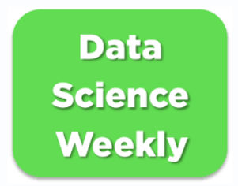

# 
 Machine Learning projects

  

## Supervised Machine Learning: 

### Project:
<a href="https://www.walmart.com/" target="_blank">Walmart Inc.</a>  is an American multinational retail corporation that operates a chain of hypermarkets, discount department stores, and grocery stores from the United States. The company was founded by Sam Walton in 1962.

### Goal:
**To build a machine learning model able to estimate the weekly sales in their stores, with the best precision possible**
- EDA + preprocessing
- Train a **linear regression model**
- Train a **regularized regression model** to avoid overfitting

## Supervised Machine Learning: 

### Project:
<a href="https://www.datascienceweekly.org/" target="_blank">www.datascienceweekly.org</a> is a famous newsletter curated by independent data scientists. Anyone can register his/her e-mail address on this website to receive weekly news about data science and its applications!

### Goal:
**Try to discover a new lever for action to improve the newsletter's conversion rate, by building a model that predicts if a given user will subscribe to the newsletter, using just a few information about the user**
- EDA
- Train model(s) and evaluate performances
- Apply the model to the new virgin file.
- Analyze results and make recommendations to improve conversion rate

## Unsupervised Machine Learning: 

### Project:
<a href="https://www.uber.com/fr/fr/" target="_blank">Uber</a> is one of the most famous startup in the world. It started as a ride-sharing application for people who couldn't afford a taxi. Now, Uber expanded its activities to Food Delivery with Uber Eats, package delivery, freight transportation and even urban transportation with Jump Bike and Lime that the company funded.

### Goal:
**To create algorithms that will determine where are the hot-zones that drivers should be in**
- Create an algorithm to find hot zones
- Visualize results on a map

> Video link to understand the code (FR):  https://share.vidyard.com/watch/TcUaLF5jspnDdJ2R1Gay2C?